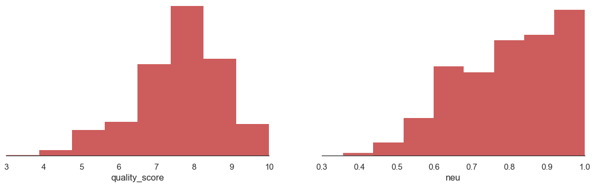
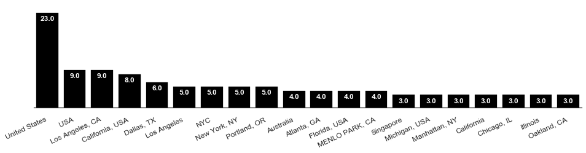
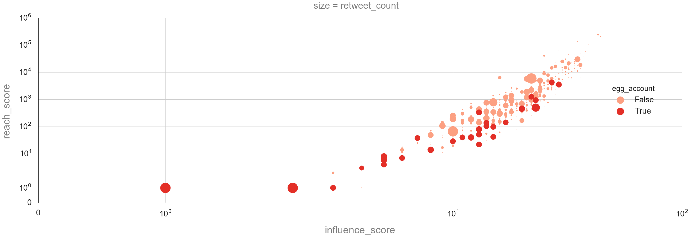
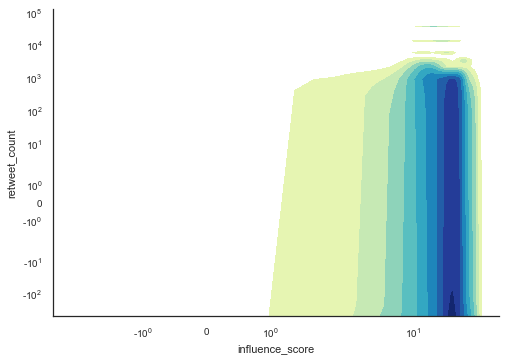
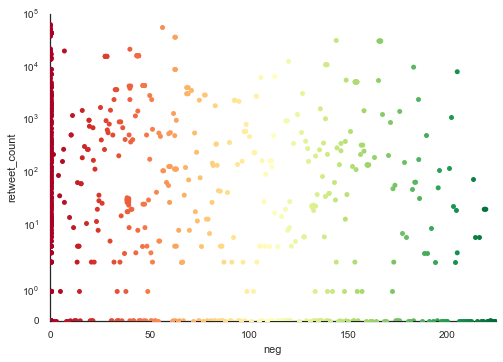

1. Overview of astetik's functionality
=====================================

First let's get some data (in this case 1000 tweets about Donald Trump.
I'm using Somecode Twitter Research kit to get the data directly in to a
pandas dataframe from Twitter API

.. code:: python

    import somecode as some
    df = some.search("trump",100)

.. parsed-literal::

    
    DataFrame with n=100 for keyword 'trump' created on 2016-11-13 10:45:58 succesfully withour errors.
    

1.1. List of Functions
----------------------

-  Text (e.g. tweeets)
-  Descriptive Stats
-  Bars
-  Side-by-side Histogram
-  Bubble Chart (4 dimensions)
-  Heatmap Correlation (up to 40 variables)
-  Kernel Density Estimation
-  Swarming
-  OLS Regression test

1.2. Common function parameters
-------------------------------

Because generally the user is required to spend much time to figure out
basic configuration, such as titles, scales etc, astetik is focused on
making frequently repeated operations as intuitive accessible as
possible.

Example paramaters:

-  title / string to be used as a title for the graphic
-  suptitle / string to be used as subtitle for the graphic
-  xscale / for setting the scale of x axis ("linear","symlog","log")
-  yscale / see above line
-  color / for changing a single color
-  palette / for changing a palette of colors (astetik is using Seaborn
   palettes but you could use any)

2. Examples of text and table presentation
==========================================

The below examples highlight astetik's functionality when used at the
most basic level.

2.1. Tweets with most retweets
------------------------------

.. code:: python

    astetik.text(df,'text',5,sort_by='retweet_count')

.. raw:: html

    RT @TheHashtag0nist: Joe: I hid all the pens from Trump
    Obama: Why?
    Joe: Because he bringing his own.
    Obama: ???
    Joe: HE'S BRINGING HIS OWN…

.. raw:: html

    RT @PrisonPlanet: Trump supporters are being physically attacked in schools across America yet THIS is the story the media focuses on. http…

.. raw:: html

    RT @LoveCescMagic: Trump: Can I get past
    Biden: What's the password
    Trump: I don't know
    Biden: Losers says what
    Trump: What
    Obama: JOE http…

.. raw:: html

    RT @killfemme: In the middle of a Trump protest in Manhattan — so beautiful. https://t.co/ItKfmuOUwf

.. raw:: html

    RT @TheAnonnMessage: BREAKING NEWS: 100,000 protesters march on the streets of LA in a show of solidarity against Trump. #TrumpProtest http…

2.2. Negative tweets sorted by number of retweets
-------------------------------------------------

.. code:: python

    astetik.text(df[df.neg > 0.2],'text',"Negative tweets with many retweets",5,sort_by='retweet_count')

.. raw:: html

    <h3>Negative tweets with many retweets</h3>

.. raw:: html

    RT @_atypicalsgirls: Truly Inappropriate Trump Photo Gone Viral;;;;
    
    https://t.co/q32FShvc7n

.. raw:: html

    RT @_onlyfunnytweet: Truly Inappropriate Trump Photo Gone Viral;;;;
    
    https://t.co/78F3HyWRV2

.. raw:: html

    RT @memesuppIy: "Trump Won. Who's fucked?" https://t.co/5syr1gOy0g

.. raw:: html

    "Nuttall looks like a £ucking clown and doesn't even need the make up."  Lmao. Always worth reading the comments... https://t.co/I5TfjSeBR5

.. raw:: html

    RT @WildeThingy: Dear  Donald Trump, please can you first build a wall round gorilla enclosures to keep the toddlers out. #NeverForget

Descritive statistics in a table
--------------------------------

.. code:: python

    astetik.descriptive(df,['neg','neu','pos'],"Sentiment")

.. raw:: html

     <table class="tg" style="undefined;table-layout: fixed; width: 500px; border-style: hidden; border-collapse: collapse;"> <colgroup> <col style="width: 150px"> <col style="width: 120px"> <col style="width: 120px"> <col style="width: 120px"> <col style="width: 120px"> </colgroup> <h5></h5> <h4><i>Sentiment</i></h4> 
 <tr> <th class="tg-ejgj"></th> <th class="tg-anay">median</th> <th class="tg-anay">mean</th> <th class="tg-anay">std</th> <th class="tg-anay">total</th> </tr> <tr> <td class="tg-ejgj">neg</td> <td class="tg-jua3">0.06</td> <td class="tg-jua3">0.09</td> <td class="tg-jua3">0.11</td> <td class="tg-jua3">93</td> </tr> <tr> <td class="tg-ejgj">neu</td> <td class="tg-jua3">0.82</td> <td class="tg-jua3">0.81</td> <td class="tg-jua3">0.14</td> <td class="tg-jua3">810</td> </tr> <tr> <td class="tg-ejgj">pos</td> <td class="tg-jua3">0.0</td> <td class="tg-jua3">-0.01</td> <td class="tg-jua3">0.45</td> <td class="tg-jua3">-6</td> </tr> </table> 

OLS Regression Test
-------------------

.. code:: python

    astetik.ols(df,'retweet_count','neg','neu','pos')

.. raw:: html

     <table class="tg" style="undefined;table-layout: fixed; width: 500px; border-style: hidden; border-collapse: collapse;"> <colgroup> <col style="width: 150px"> <col style="width: 120px"> <col style="width: 120px"> <col style="width: 120px"> <col style="width: 120px"> </colgroup> <h5>Independent Variable : retweet_count</h5> <h4><i>OLS Summary</i></h4> 
 <tr> <th class="tg-ejgj"></th> <th class="tg-anay">coef</th> <th class="tg-anay">t</th> <th class="tg-anay">p_t</th> <th class="tg-anay">std_error</th> </tr> <tr> <td class="tg-ejgj">Intercept</td> <td class="tg-jua3">-2144.4103</td> <td class="tg-jua3">-0.451</td> <td class="tg-jua3">0.6521</td> <td class="tg-jua3">4754.7474</td> </tr> <tr> <td class="tg-ejgj">neg</td> <td class="tg-jua3">4556.741</td> <td class="tg-jua3">0.5101</td> <td class="tg-jua3">0.6101</td> <td class="tg-jua3">8933.8385</td> </tr> <tr> <td class="tg-ejgj">neu</td> <td class="tg-jua3">5230.9289</td> <td class="tg-jua3">1.0742</td> <td class="tg-jua3">0.283</td> <td class="tg-jua3">4869.404</td> </tr> <tr> <td class="tg-ejgj">pos</td> <td class="tg-jua3">-2045.194</td> <td class="tg-jua3">-1.1611</td> <td class="tg-jua3">0.2459</td> <td class="tg-jua3">1761.4334</td> </tr>

3. Examples of plot presentation
================================

3.1. Side-by-side histograms
----------------------------

.. code:: python

    astetik.histogram(df,['quality_score','neu'])

3.2. Horizontal bars for a single dimension of data
---------------------------------------------------

.. code:: python

    astetik.bars(df.location)

3.3. Bubble chart for displaying 4 dimensions of data
-----------------------------------------------------

.. code:: python

    astetik.bubble(df,'influence_score','reach_score','egg_account','retweet_count',xscale='symlog', yscale='symlog')

3.4. Correlation heatmap for up to 30 variables
-----------------------------------------------

.. code:: python

    astetik.correlationt(df)

.. image:: output_26_0.png

3.5. Kernel Density Estimation
------------------------------

.. code:: python

    astetik.kde(df.influence_score,df.retweet_count,xscale="symlog",yscale="symlog")

3.6. Swarming
-------------

.. code:: python

    astetik.swarm(df,'neg','retweet_count',yscale="symlog")

4. Examples of general presentation
===================================

4.1. Toggle for hiding code cells
---------------------------------

.. code:: python

    astetik.toggle()

.. raw:: html

    
        <a href="javascript:code_toggle()">toggle code cells</a>

.. code:: python

    astetik.warning()

5. Using astetik in your next research project
=============================================

::

    pip install astetik
